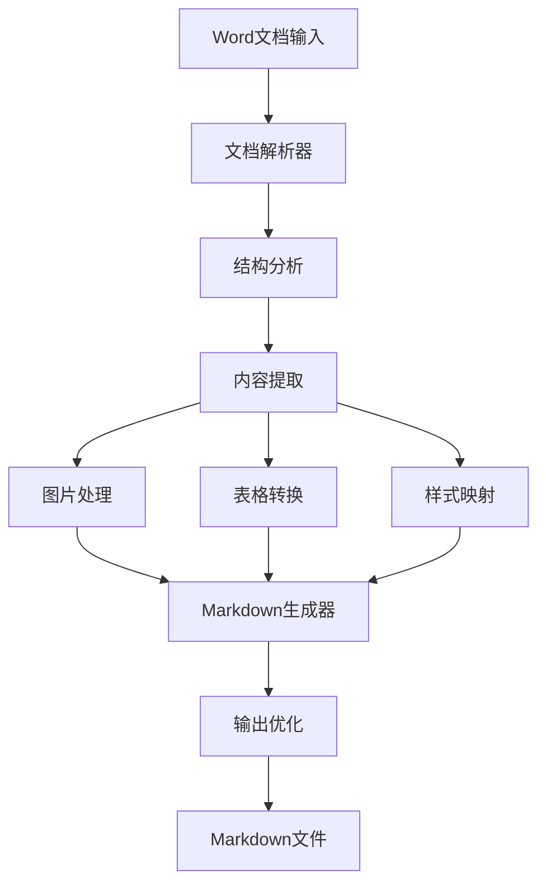

# Word转Markdown工具 (Word2MD)

🚀 **一键将Word文档(.docx)转换为高质量Markdown格式的专业工具**

[](https://opensource.org/licenses/MIT)
[](https://nodejs.org/)
[](https://www.typescriptlang.org/)

## ✨ 项目概述

Word2MD是一个强大的文档转换工具，专门设计用于将Microsoft Word文档(.docx)精确转换为Markdown格式。支持复杂文档结构、图片、表格、链接等元素的智能转换。

### 🎯 核心特性

- ✅ **高质量转换**: 保持原文档的结构和格式
- 🖼️ **图片处理**: 自动提取并转换嵌入图片
- 📊 **表格支持**: 完美转换复杂表格结构
- 🔗 **链接保持**: 保留所有超链接和内部引用
- 📝 **样式映射**: 智能映射标题、粗体、斜体等样式
- 🔢 **列表处理**: 支持有序和无序列表转换
- ⚡ **批量处理**: 支持多文件批量转换
- 🎨 **自定义配置**: 灵活的转换选项

## 🔧 技术方案分析

经过深度研究，我们推荐以下技术实现方案：

### 方案一：Node.js + mammoth.js (推荐 ⭐)

```javascript
// 核心技术栈
- mammoth.js: 专业的docx解析库
- turndown: HTML到Markdown转换
- jszip: 处理docx文件结构
- commander.js: CLI界面
- electron (可选): 桌面应用
```

**优势:**
- mammoth.js专门为docx设计，转换质量高
- JavaScript生态丰富，扩展性强
- 可轻松制作CLI、Web、桌面多端应用
- 社区活跃，文档完善

### 方案二：Python + python-docx (备选)

```python
# 核心技术栈
- python-docx: Word文档解析
- pypandoc: 格式转换引擎
- markdown: Markdown生成
- click: CLI框架
```

### 方案三：Go + 自定义解析 (高性能)

```go
// 核心技术栈
- gooxml: Go语言docx处理
- 自定义Markdown生成器
- cobra: CLI框架
```

## 🏗️ 系统架构



### 核心模块设计

1. **文档解析模块** (DocParser)
   - 解析.docx文件结构
   - 提取XML内容
   - 处理文档关系

2. **内容转换模块** (ContentConverter)
   - 段落和标题转换
   - 列表处理
   - 文本样式映射

3. **资源处理模块** (ResourceHandler)
   - 图片提取和保存
   - 链接处理
   - 嵌入对象处理

4. **表格转换模块** (TableConverter)
   - 复杂表格结构分析
   - Markdown表格生成
   - 合并单元格处理

5. **输出优化模块** (OutputOptimizer)
   - Markdown格式优化
   - 文件结构组织
   - 质量检查

## 🚀 快速开始

### 环境要求

- Node.js 18+
- npm 或 yarn
- 支持的操作系统: Windows, macOS, Linux

### 安装

```bash
# 全局安装
npm install -g word2md

# 或本地项目安装
npm install word2md
```

### 基本使用

```bash
# 转换单个文件
word2md document.docx

# 指定输出文件
word2md document.docx -o output.md

# 批量转换
word2md *.docx

# 转换并提取图片到指定目录
word2md document.docx --images-dir ./images

# 自定义配置
word2md document.docx --config config.json
```

### 编程接口

```javascript
const Word2MD = require('word2md');

const converter = new Word2MD({
  extractImages: true,
  imageDir: './images',
  tableStyle: 'github',
  headingStyle: 'atx'
});

// 转换文件
converter.convertFile('document.docx')
  .then(markdown => {
    console.log('转换成功!');
    console.log(markdown);
  })
  .catch(err => {
    console.error('转换失败:', err);
  });

// 转换Buffer
converter.convertBuffer(docxBuffer)
  .then(result => {
    const { markdown, images } = result;
    // 处理结果
  });
```

## ⚙️ 配置选项

```json
{
  "extractImages": true,
  "imageDir": "./images",
  "imagePrefix": "img_",
  "tableStyle": "github",
  "headingStyle": "atx",
  "codeBlockStyle": "fenced",
  "linkStyle": "inline",
  "preserveFormatting": true,
  "customStyles": {
    "highlight": "**",
    "strikethrough": "~~"
  }
}
```

## 🔥 核心功能实现

### 1. 文档解析核心

```javascript
class DocxParser {
  async parse(filePath) {
    const buffer = await fs.readFile(filePath);
    const zip = await JSZip.loadAsync(buffer);
    
    // 解析文档结构
    const documentXml = await zip.file('word/document.xml').async('string');
    const relationships = await this.parseRelationships(zip);
    const styles = await this.parseStyles(zip);
    
    return {
      content: this.parseContent(documentXml),
      relationships,
      styles,
      images: await this.extractImages(zip)
    };
  }
}
```

### 2. 智能样式转换

```javascript
class StyleConverter {
  convertRun(run, styles) {
    let text = run.text;
    const props = run.properties;
    
    if (props.bold) text = `**${text}**`;
    if (props.italic) text = `*${text}*`;
    if (props.underline) text = `<u>${text}</u>`;
    if (props.strikethrough) text = `~~${text}~~`;
    
    return text;
  }
}
```

### 3. 表格转换算法

```javascript
class TableConverter {
  convertTable(table) {
    const rows = table.rows.map(row => {
      const cells = row.cells.map(cell => 
        cell.content.replace(/\n/g, '<br>')
      );
      return `| ${cells.join(' | ')} |`;
    });
    
    // 添加表头分隔符
    if (rows.length > 0) {
      const separator = '|' + ' --- |'.repeat(table.rows[0].cells.length);
      rows.splice(1, 0, separator);
    }
    
    return rows.join('\n');
  }
}
```

## 🧪 测试用例

```javascript
describe('Word2MD转换测试', () => {
  test('基本文本转换', async () => {
    const result = await word2md.convertText('Hello **World**');
    expect(result).toBe('Hello **World**');
  });
  
  test('表格转换', async () => {
    const table = createTestTable();
    const result = await word2md.convertTable(table);
    expect(result).toContain('|');
  });
  
  test('图片提取', async () => {
    const result = await word2md.convertFile('test.docx');
    expect(result.images).toHaveLength(2);
  });
});
```

## 📊 性能优化

### 内存优化
- 流式处理大文件
- 分块解析XML内容
- 图片异步处理

### 速度优化
- 并行处理多个元素
- 缓存样式解析结果
- 预编译正则表达式

## 🛠️ 开发指南

### 项目结构

```
word2md/
├── src/
│   ├── core/           # 核心转换逻辑
│   ├── parsers/        # 文档解析器
│   ├── converters/     # 格式转换器
│   ├── utils/          # 工具函数
│   └── cli/            # 命令行接口
├── tests/              # 测试文件
├── docs/               # 文档
└── examples/           # 示例文件
```

### 开发环境设置

```bash
# 克隆项目
git clone https://github.com/your-repo/word2md.git
cd word2md

# 安装依赖
npm install

# 运行开发模式
npm run dev

# 运行测试
npm test

# 构建项目
npm run build
```

### 贡献代码

1. Fork项目
2. 创建特性分支: `git checkout -b feature/amazing-feature`
3. 提交更改: `git commit -m 'Add amazing feature'`
4. 推送分支: `git push origin feature/amazing-feature`
5. 提交Pull Request

## 🔍 常见问题

### Q: 为什么选择mammoth.js而不是pandoc？
A: mammoth.js专门为docx设计，转换质量更高，且无需外部依赖。pandoc虽然功能全面，但需要额外安装。

### Q: 如何处理复杂的表格合并单元格？
A: 工具会自动检测合并单元格并使用HTML表格语法，或者将复杂表格转换为简化的Markdown表格。

### Q: 支持数学公式转换吗？
A: 当前版本支持基本的数学符号，复杂公式会保留为LaTeX格式或转换为图片。

## 📈 路线图

- [ ] **v1.0** - 基础转换功能
- [ ] **v1.1** - 批量处理和CLI优化
- [ ] **v1.2** - Web界面版本
- [ ] **v1.3** - 桌面应用(Electron)
- [ ] **v2.0** - 数学公式和复杂格式支持
- [ ] **v2.1** - 云端API服务
- [ ] **v3.0** - AI辅助格式优化

## 📄 许可证

本项目采用 [MIT License](LICENSE) 许可证。

## 🤝 贡献者

感谢所有为这个项目做出贡献的开发者！

## 📞 联系我们

- 提交Issue: [GitHub Issues](https://github.com/your-repo/word2md/issues)
- 邮件: word2md@example.com
- 讨论: [GitHub Discussions](https://github.com/your-repo/word2md/discussions)

---

**让文档转换变得简单而优雅! 🎉**